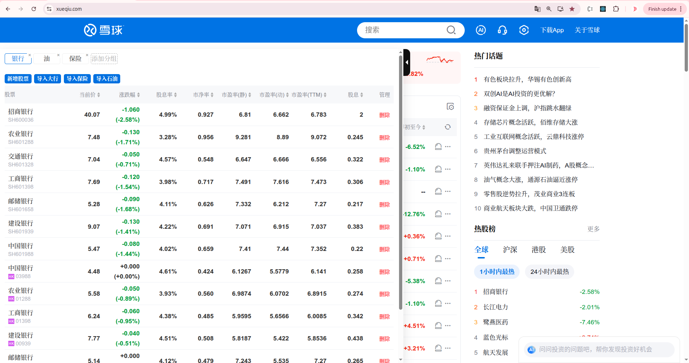
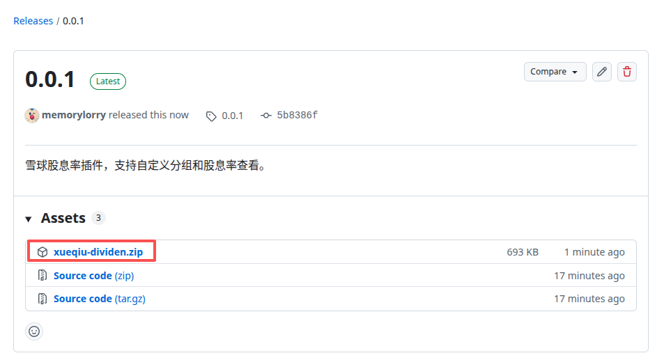
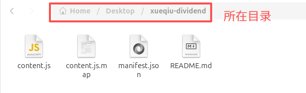
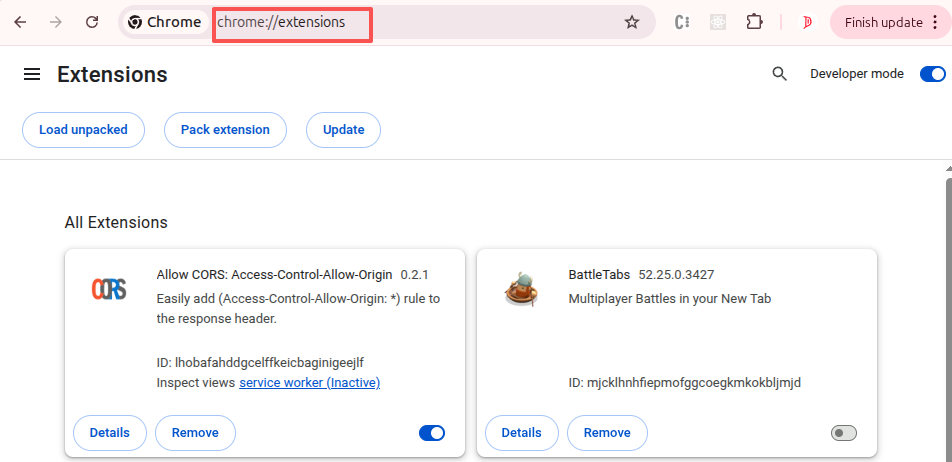
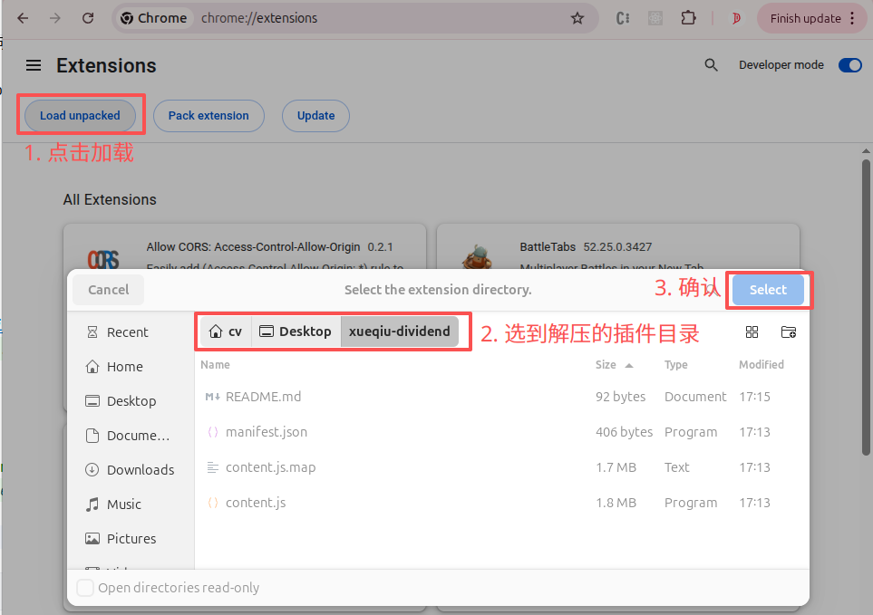
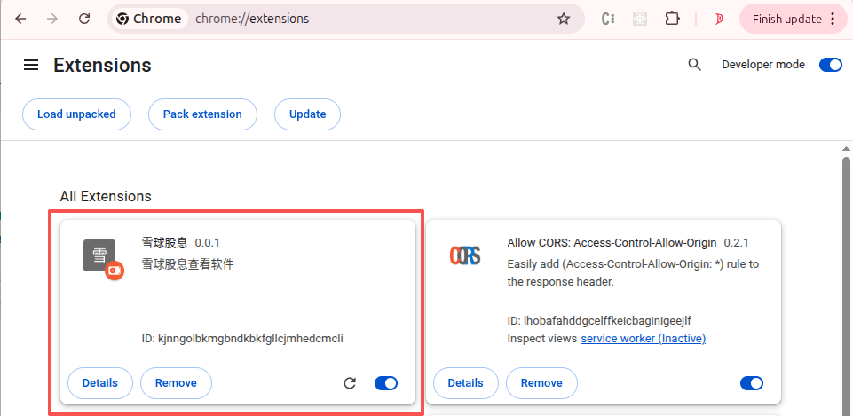
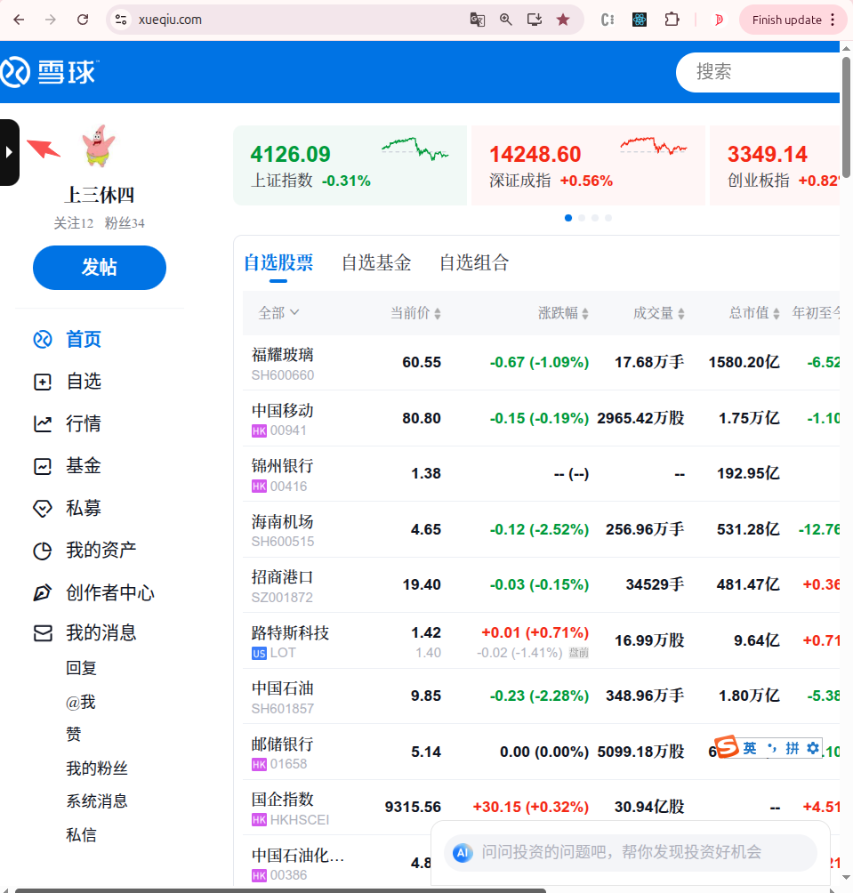

# ❄ 雪球投资股息率插件

雪球投资股息率插件，帮你快速查看股票股息率信息。

---

## ✨ 亮点功能

- **批量查看股息率**：支持同时查看多只股票，并可排序  
- **自定义股票分组**：灵活管理你的股票组合  
- **数据本地化**：所有数据存储在 Chrome 的 Local Storage，安全可靠

---

💡 使用说明：  
1. 安装插件到 Chrome  
2. 打开雪球网站即可自动显示股息率面板  
3. 可通过分组管理、排序功能快速查看所需数据

# 1. 安装
在如下图的[发布页](https://github.com/touziren/xueqiu-dividend/releases/tag/0.0.1),下载`xueqiu-dividend.zip`。

解压下载的文件后，得到如下图的文件。

打开chrome浏览器，在地址栏输入`chrome://extensions/`，回车进入插件管理页面。

按照如图所示，一步步地加载插件。

加载完毕后，插件列表多出了一个插件，此时插件安装成功。

# 2. 使用

打开[雪球](https://xueqiu.com/)并登录账号后,可以看到左侧多了1个侧边栏。

点击黑色的侧边栏，即可看到如下图效果。`注意：第一次使用，需要自己创建股票分组，然后导入自己喜欢的股票！`

# 3. 感谢
如果你喜欢该插件，欢迎你向`294092869@qq.com`邮箱提意见!
